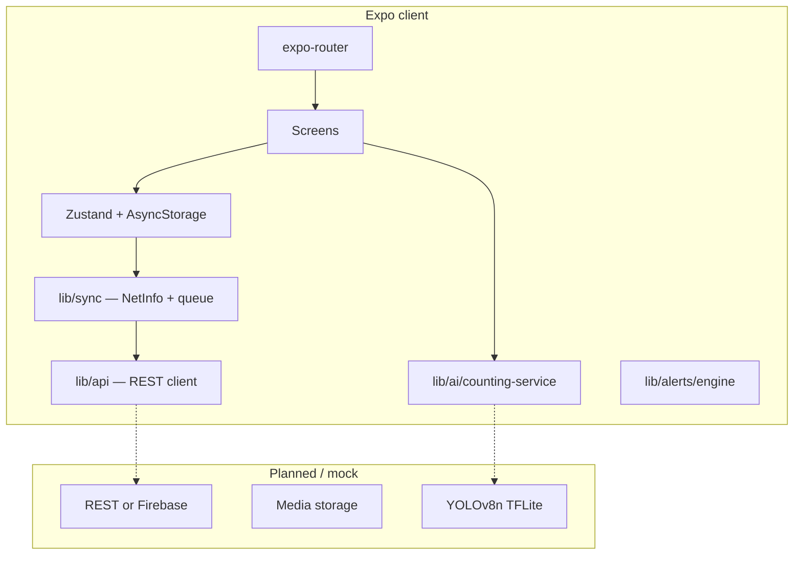

# Poultra — System Architecture

> Last updated: 2026-05-19 · SDK 54 · Bundle ID `ai.poultra.app`

## Overview

Poultra AI is an Expo (React Native) mobile app for **AI-assisted poultry counting** and farm operations. The current codebase is a **client-first MVP**: UI, state, and demo inference run on-device; a production backend and TFLite model are planned behind stable interfaces.

## High-level diagram

## Repository layout

| Path | Responsibility |
|------|----------------|
| `app/` | File-based routes (tabs, auth, counting, farms) |
| `components/neo3d/` | Neon Field shell (ambient, 3D cards, landing) |
| `components/ui/` | Primitives (button, input, toast, card-3d) |
| `lib/stores/` | Persisted Zustand domains |
| `lib/api/` | HTTP client, endpoints, config |
| `lib/sync/` | Connectivity + upload queue |
| `lib/ai/` | Counting + tracking (mock → TFLite) |
| `lib/alerts/` | Threshold rule engine |
| `types/domain.ts` | Shared domain types |
| `docs/` | Architecture, roadmap, changelog |

## Navigation

| Route | Purpose |
|-------|---------|
| `app/index.tsx` | Auth gate → onboarding / login / tabs |
| `app/(tabs)/dashboard` | Home command center |
| `app/(tabs)/count` | Scan modes hub |
| `app/(tabs)/farms` | Farm portfolio |
| `app/(tabs)/you` | Account hub |
| `app/count/live\|image\|video` | Counting workflows |
| `app/farm/[id]`, `farm/new` | Farm detail & create |
| `profile`, `reports`, `subscription`, `admin` | Settings & ops |

Root layout: `app/_layout.tsx` (fonts, theme, toast, error boundary).

## State management

All stores use **Zustand `persist`** → **AsyncStorage**.

| Store | Key | Data |
|-------|-----|------|
| `auth-store` | `poultra-auth` | User, auth flags |
| `farm-store` | `poultra-farms` | Farms, houses, selection |
| `session-store` | `poultra-sessions` | Counting sessions + sync status |
| `alert-store` | `poultra-alerts` | Notifications |
| `settings-store` | `poultra-settings` | Thresholds, sync toggle |

### Entity relationships

- **User** owns **Farms**
- **Farm** has **PoultryHouses**
- **CountingSession** links to farm (+ optional house)
- **Alert** may reference a farm

## Counting pipeline

1. **Input** — camera frame, image URI, or video frames
2. **Detection** — `detectFromImage` / `generateStreamFrame` (mock PRNG today)
3. **Tracking** — `trackUpdate` (IOU ByteTrack-style) for live/video dedupe
4. **Persist** — `session-store.addSession` → `syncStatus: pending`
5. **Sync** — `lib/sync/queue` uploads via `lib/api/sessions`
6. **Side effects** — house `currentCount`, optional alerts via `lib/alerts/engine`

Production target: `lib/ai/inference.native.ts` + `expo-camera` frame processor.

## Sync & offline

- **Connectivity:** `@react-native-community/netinfo` via `lib/sync/connectivity.ts`
- **Queue:** `lib/sync/queue.ts` — retries with backoff, marks failed items
- **Auto-sync:** `useAutoSync` in `lib/sync/index.ts` when settings allow

Sessions stay `pending` until the API acknowledges upload (mock API simulates latency when `EXPO_PUBLIC_API_MODE=mock`).

## API layer

- **Config:** `lib/api/config.ts` — base URL, mode (`mock` \| `live`)
- **Client:** `lib/api/client.ts` — fetch wrapper, errors, auth header hook
- **Endpoints:** `lib/api/sessions.ts`, `lib/api/health.ts`

Swap `EXPO_PUBLIC_API_URL` when a real backend is ready; interfaces stay stable.

## Alerts

`lib/alerts/engine.ts` evaluates settings thresholds after counts:

- Mortality vs `mortalityThreshold`
- Capacity % vs `densityThreshold` (proxy for overcrowding)

## Integrations

| Package | Status |
|---------|--------|
| expo-dev-client | Active |
| expo-camera | Planned for live count |
| expo-notifications | Dependency only — not wired |
| posthog-js | Web iframe preview only |
| react-native-maps | Optional map component |

## Security (planned)

- Tokens in `expo-secure-store`
- Firebase / Supabase security rules on `ownerId`
- No secrets in client bundle

## Related docs

- [ROADMAP.md](./ROADMAP.md) — phased delivery plan
- [CHANGELOG.md](./CHANGELOG.md) — release history
