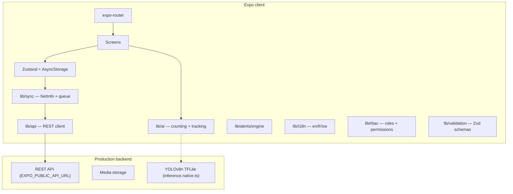

# aniFarm — System Architecture

> Last updated: 2026-05-20 · SDK 54 · Bundle ID `ai.anifarm.app`

## Overview

aniFarm is an Expo (React Native) mobile app for **AI-assisted livestock counting** across poultry, cattle, sheep, goats, pigs, horses, aquaculture, and mixed animal farming. The vision model classifies **alive livestock**, **dead livestock**, and **people** (excluded from operational counts). The codebase is a **client-first MVP**: UI, state, and on-device inference run locally; a production backend is wired via a stable REST interface and ready to activate by setting `EXPO_PUBLIC_API_URL`.

## High-level diagram

## Repository layout

| Path | Responsibility |
|------|----------------|
| `app/` | File-based routes (tabs, auth, counting, farms) |
| `components/neo3d/` | Neon Field shell (ambient, 3D cards, landing) |
| `components/ui/` | Primitives (button, input, toast, card-3d, switch, badge) |
| `lib/stores/` | Persisted Zustand domains |
| `lib/api/` | HTTP client, endpoints, config |
| `lib/sync/` | Connectivity + upload queue |
| `lib/ai/` | Counting, tracking, batch queue, model registry |
| `lib/alerts/` | Threshold rule engine + local push notifications |
| `lib/validation/` | Zod schemas for all forms |
| `lib/i18n/` | Translations — English, French, Swahili |
| `lib/rbac/` | Role-based access control |
| `lib/monitoring/` | Sentry error tracking scaffold |
| `lib/payments/` | RevenueCat in-app purchase scaffold |
| `lib/integrations/` | ERP webhook delivery |
| `lib/utils/` | expo-go detection, feature flags, performance, error logger |
| `types/domain.ts` | Shared domain types |
| `docs/` | Architecture, roadmap, API, changelog |

## Navigation

| Route | Purpose |
|-------|---------|
| `app/index.tsx` | Auth gate → onboarding / login / tabs |
| `app/onboarding.tsx` | 3-step paginated onboarding |
| `app/(auth)/login` | Email + phone + Google sign-in |
| `app/(auth)/register` | Account creation |
| `app/(auth)/otp` | Phone OTP verification |
| `app/(auth)/forgot` | Password reset |
| `app/(tabs)/dashboard` | Home command center |
| `app/(tabs)/scan` | Scan modes hub (live / image / video) |
| `app/(tabs)/farms` | Farm portfolio |
| `app/(tabs)/you` | Account hub |
| `app/(tabs)/count-live` | Live camera counting |
| `app/(tabs)/count-image` | Still image counting |
| `app/(tabs)/count-video` | Video counting |
| `app/(tabs)/analytics` | Insights & charts |
| `app/(tabs)/alerts` | Alert feed |
| `app/farm/[id]` | Farm detail |
| `app/farm/new` | Create farm (Zod validated) |
| `app/house/new` | Create house (Zod validated) |
| `app/profile` | User settings |
| `app/reports` | PDF / CSV / Excel export |
| `app/subscription` | Billing & tier management |
| `app/admin` | Operator dashboard |

Root layout: `app/_layout.tsx` (fonts, theme, toast, error boundary).

## State management

All stores use **Zustand `persist`** → **AsyncStorage**. Stores start empty — no seed data.

| Store | Key | Data |
|-------|-----|------|
| `auth-store` | `poultra-auth` | User, auth flags, onboarding flag |
| `farm-store` | `poultra-farms` | Farms, houses, selection |
| `session-store` | `poultra-sessions` | Counting sessions + sync status |
| `alert-store` | `poultra-alerts` | Notifications |
| `settings-store` | `poultra-settings` | Thresholds, language, sync toggle |

### Entity relationships

- **User** owns **Farms**
- **Farm** has **LivestockPen** units (barns, pens, paddocks)
- **CountingSession** links to farm (+ optional house)
- **Alert** may reference a farm

## Counting pipeline (livestock & flocks)

1. **Input** — phone camera, image, video, or CCTV stream (RTSP/HLS)
2. **Detection** — `lib/ai/counting-service` classifies each box:
   - `livestock_alive` → counted toward herd/flock total
   - `livestock_dead` → welfare flag (not added to operational count)
   - `human` → detected but **excluded** from totals
3. **Tracking** — `trackUpdate` (ByteTrack-style IOU) on **alive** boxes only for live/video/CCTV dedupe
4. **Smoothing (CCTV)** — `lib/cctv/live-engine.ts` stabilizes alive totals between frames
5. **Persist** — `session-store.addSession` with `aliveCount`, `deadCount`, `excludedHumans`
6. **Sync** — `lib/sync/queue` uploads via `lib/api/sessions`
7. **Alerts** — `lib/alerts/evaluate-count.ts` + `lib/alerts/engine.ts` (mortality, dead-in-frame, overcrowding)

### CCTV live path

| Mode | Path |
|------|------|
| Mock (`EXPO_PUBLIC_API_MODE=mock`) | `openCctvSocket` → interval `simulateCctvDetection` per feed |
| Live API | WebSocket `wss://…/cctv/ws?feedId=` with polling fallback |

`useCctvFeeds` (CCTV tab) keeps connections alive, updates pen counts, saves periodic CCTV sessions, and raises **dead animal** alerts when `deadCount` increases.

### Batch offline jobs

`lib/ai/batch-queue.ts` — queue multiple images while offline, process sequentially when connectivity returns, prune completed jobs after 7 days.

### Model versioning

`lib/ai/model-registry.ts` — pin a specific TFLite model version per farm, OTA download scaffold, fallback to bundled model.

## Sync & offline

- **Connectivity:** `@react-native-community/netinfo` via `lib/sync/connectivity.ts`
- **Queue:** `lib/sync/queue.ts` — retries with exponential backoff (max 4 attempts), marks failed items
- **Auto-sync:** `useAutoSync` in `lib/sync/index.ts` triggers when connectivity returns and `settings.autoSync` is enabled

## API layer

- **Config:** `lib/api/config.ts` — base URL from `EXPO_PUBLIC_API_URL`
- **Client:** `lib/api/client.ts` — fetch wrapper, timeout, auth header, typed errors
- **Endpoints:** `lib/api/sessions.ts`, `lib/api/media.ts`, `lib/api/health.ts`

Set `EXPO_PUBLIC_API_URL` to activate the real backend. All interfaces are stable.

## Alerts & notifications

`lib/alerts/engine.ts` and `lib/alerts/evaluate-count.ts` run after manual counts and CCTV updates:

- **Dead in frame** (`mortality_detected`) when `deadCount >= settings.deadAlertMin`
- **7-day mortality** vs `mortalityThreshold`
- **Capacity %** vs `densityThreshold` (overcrowding proxy)

When a threshold is breached:
1. An in-app `Alert` is added to `alert-store`
2. A local push notification is scheduled via `lib/notifications/scheduleLocalAlert` (if push enabled)

## Validation

All forms use **Zod** schemas from `lib/validation/schemas.ts`:

| Schema | Used in |
|--------|---------|
| `registerSchema` | `app/(auth)/register.tsx` |
| `loginSchema` | `app/(auth)/login.tsx` |
| `newFarmSchema` | `app/farm/new.tsx` |
| `newHouseSchema` | `app/house/new.tsx` |

`parseForm()` returns typed data or a flat `Record<string, string>` of field errors.

## Internationalisation

`lib/i18n/` provides full translations for **English**, **French**, and **Swahili**.

- `useTranslations()` — React hook, reads `settings.language`
- `getTranslations()` — non-hook version for stores/utils
- Language persisted in `settings-store`

## RBAC

`lib/rbac/index.ts` defines three roles with additive permissions:

| Role | Key permissions |
|------|----------------|
| `farmer` | Read/create farms, houses, sessions; read alerts |
| `manager` | All farmer + delete farms/houses, invite team, export analytics |
| `admin` | All manager + remove team, admin dashboard |

`usePermission(permission)` hook for UI gating.

## Integrations

| Package / Module | Status |
|---------|--------|
| `expo-dev-client` | Active |
| `expo-camera` | Active — `CameraPreview` component |
| `expo-notifications` | Active — local alerts on threshold breach; push token registration |
| `expo-print` + `expo-sharing` | Active — PDF/CSV/Excel export |
| `posthog-js` | Web iframe preview only |
| `react-native-maps` | Optional map component |
| `lib/monitoring/sentry.ts` | Scaffold — uncomment after installing `@sentry/react-native` |
| `lib/payments/revenue-cat.ts` | Scaffold — uncomment after installing `react-native-purchases` |
| `lib/integrations/erp-webhooks.ts` | Active — HMAC-signed per-farm webhook delivery |

## Security

- Auth tokens stored in `expo-secure-store` (planned — auth-store ready for real provider)
- Real auth provider (Firebase / Supabase) replaces stub in `lib/stores/auth-store.ts`
- Firebase / Supabase security rules enforce `ownerId` on all farm/session data
- No secrets in client bundle — all keys via `EXPO_PUBLIC_*` env vars
- ERP webhook payloads signed with HMAC-SHA256

## Environment variables

| Variable | Purpose |
|----------|---------|
| `EXPO_PUBLIC_API_URL` | Backend base URL (default: `https://api.anifarm.app/v1`) |
| `EXPO_PUBLIC_USE_TFLITE` | Set to `true` to enable native TFLite inference |
| `EXPO_PUBLIC_SENTRY_DSN` | Sentry DSN for error tracking |
| `EXPO_PUBLIC_REVENUECAT_KEY_IOS` | RevenueCat iOS key |
| `EXPO_PUBLIC_REVENUECAT_KEY_ANDROID` | RevenueCat Android key |

## Related docs

- [ROADMAP.md](./ROADMAP.md) — phased delivery plan
- [API.md](./API.md) — endpoint reference
- [CHANGELOG.md](./CHANGELOG.md) — release history
